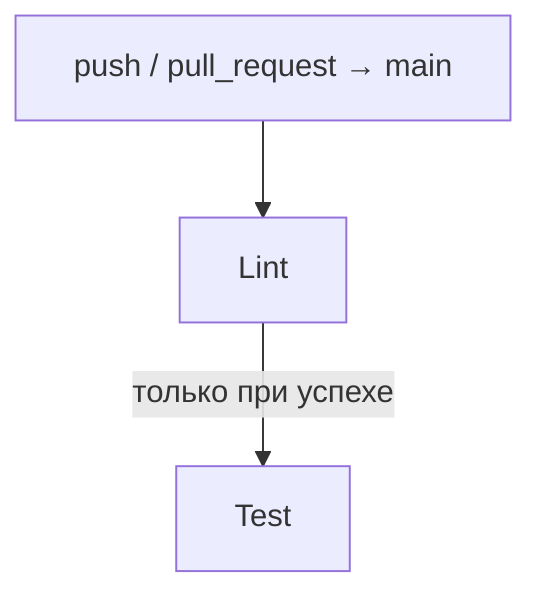
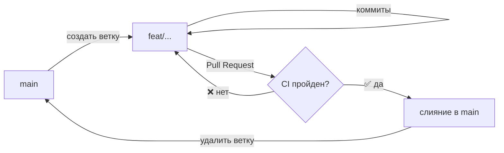

# Руководство по стилю кода и коммитам

Для обеспечения единообразия кода в проекте настроены автоматические проверки
и форматирование файлов различных типов. Все конфигурации согласованы между
настройками VS Code (`.vscode/settings.json`) и хуками `pre-commit`.

---

## Инструменты линтинга и форматирования

### Python

Инструмент: **Ruff** (`charliermarsh.ruff`).
Конфигурация задана в [`pyproject.toml`](../pyproject.toml).

#### Форматирование

| Параметр            | Значение                                                      |
| ------------------- | ------------------------------------------------------------- |
| Длина строки        | Максимум 100 символов                                         |
| Кавычки             | Двойные (`"double quotes"`)                                   |
| Отступы             | 4 пробела (не табы)                                           |
| Сортировка импортов | Автоматически: по алфавиту, по группам (`combine-as-imports`) |

#### Активные группы правил Ruff

| Код    | Название       | Описание                               |
| ------ | -------------- | -------------------------------------- |
| `E/W`  | pycodestyle    | Стандарт оформления PEP 8              |
| `F`    | pyflakes       | Неиспользуемые переменные, импорты     |
| `I`    | isort          | Порядок и группировка импортов         |
| `N`    | pep8-naming    | Соглашения об именовании               |
| `B`    | bugbear        | Распространённые ошибки и антипаттерны |
| `A`    | builtins       | Затенение встроенных имён Python       |
| `C4`   | comprehensions | Упрощение list/dict/set comprehensions |
| `T20`  | print          | Запрет `print()` в продакшн-коде       |
| `RET`  | return         | Упрощение конструкций `return`         |
| `PTH`  | pathlib        | Замена `os.path` на `pathlib.Path`     |
| `ERA`  | eradicate      | Закомментированный код                 |
| `COM`  | commas         | Висячие запятые                        |
| `Q`    | quotes         | Стиль кавычек                          |
| `UP`   | pyupgrade      | Современный синтаксис Python           |
| `SIM`  | simplify       | Упрощение логических конструкций       |
| `TC`   | type-checking  | Импорты только для аннотаций типов     |
| `PERF` | performance    | Неоптимальные конструкции              |
| `FURB` | refurb         | Идиоматический современный Python      |
| `LOG`  | logging        | Правильное использование `logging`     |
| `DTZ`  | datetime       | Корректная работа с часовыми поясами   |
| `RUF`  | ruff-specific  | Специфичные правила Ruff               |

Отключено: `COM812` (конфликт с форматировщиком).

#### Исключения по директориям

| Директория  | Отключённое правило | Причина                          |
| ----------- | ------------------- | -------------------------------- |
| `tests/*`   | `S101`              | Использование `assert` в тестах  |
| `scripts/*` | `T201`              | Использование `print` в скриптах |

#### Обязательные требования к Python-файлам

**Каждый** `.py`-файл в проекте обязан содержать декларацию `__all__` в начале
файла (до первой функции или класса):

```python
# Для файлов, не экспортирующих публичный API:
__all__ = ()

# Для файлов, экспортирующих хотя бы одно имя:
__all__ = ["MyClass", "my_function"]
```

Это требование обеспечивает явность публичного API модуля и соответствует
правилам Ruff группы `RUF`. Нарушение приведёт к ошибке `F822` при линтинге.

#### Прочие соглашения

- Все публичные функции и методы **обязаны иметь docstring**.
- Все функции **обязаны иметь аннотации типов** для параметров и возвращаемого
  значения.
- Точка входа (`if __name__ == "__main__":`) исключается из расчёта покрытия
  тестами (правило задано в `[tool.coverage.report]` в `pyproject.toml`).

Пример минимального корректного файла:

```python
__all__ = ["main"]


def main() -> None:
    """Точка входа в программу."""
    pass


if __name__ == "__main__":
    main()
```

**VS Code**: Расширение `charliermarsh.ruff` автоматически форматирует код и
организует импорты при сохранении файла (`editor.formatOnSave`,
`source.organizeImports`, `source.fixAll`).

---

### Markdown

Инструменты: **Markdown All in One** + **markdownlint**.

| Расширение                       | Роль                                           |
| -------------------------------- | ---------------------------------------------- |
| `yzhang.markdown-all-in-one`     | Форматировщик: выравнивание разметки и списков |
| `DavidAnson.vscode-markdownlint` | Линтер: структура, заголовки, пустые строки    |

Настройки линтера задаются в [`.markdownlint.json`](../.markdownlint.json):

- `MD013` — максимальная длина строки: 100 символов.

**VS Code**: При сохранении `.md`-файла `markdownlint` автоматически исправляет
нарушения (`editor.codeActionsOnSave` → `source.fixAll.markdownlint`).

---

### JSON и YAML

Инструмент: **Prettier** (`esbenp.prettier-vscode`).

| Параметр     | Значение                                    |
| ------------ | ------------------------------------------- |
| Длина строки | Максимум 100 символов (`--print-width 100`) |
| Типы файлов  | `.json`, `.jsonc`, `.yaml`, `.yml`          |

**VS Code**: Расширение `esbenp.prettier-vscode` является форматировщиком по
умолчанию для JSON и YAML.

---

### TOML

Инструмент: **Taplo** (`tamasfe.even-better-toml`).

| Параметр    | Значение                           |
| ----------- | ---------------------------------- |
| Типы файлов | `.toml` (включая `pyproject.toml`) |

**VS Code**: Расширение `tamasfe.even-better-toml` является форматировщиком по
умолчанию для TOML.

---

## Автоматизация через pre-commit

Все инструменты интегрированы в систему Git-хуков через **pre-commit**.
Конфигурация задана в [`.pre-commit-config.yaml`](../.pre-commit-config.yaml).

Хуки запускаются автоматически перед каждым коммитом в следующем порядке:

1. **`pre-commit-hooks`** — базовые проверки:
   - `trailing-whitespace` — удаление концевых пробелов.
   - `end-of-file-fixer` — пустая строка в конце файла.
   - `check-yaml` — валидация синтаксиса YAML.
   - `check-toml` — валидация синтаксиса TOML.
   - `check-added-large-files` — запрет коммита больших файлов.
2. **`ruff` + `ruff-format`** — линтинг и форматирование Python.
3. **`ensure-dunder-all`** — проверка наличия `__all__` во всех `.py`-файлах.
4. **`taplo-format`** — форматирование TOML.
5. **`prettier`** — форматирование JSON и YAML.
6. **`markdownlint-cli2`** — проверка и автоисправление Markdown.

### Команды

| Команда               | Описание                                      |
| --------------------- | --------------------------------------------- |
| `make lint`           | Запустить линтер Ruff вручную                 |
| `make format`         | Отформатировать Python-код через Ruff         |
| `make pre-commit-run` | Запустить все pre-commit хуки для всех файлов |
| `make test`           | Запустить тесты с расчётом покрытия кода      |

---

## CI/CD (GitHub Actions)

Пайплайн описан в [`.github/workflows/ci.yml`](../.github/workflows/ci.yml).
Запускается на `push` и `pull_request` в ветку `main`.



| Job    | Что делает                                                 |
| ------ | ---------------------------------------------------------- |
| `lint` | Запускает pre-commit хуки: Ruff, ensure-dunder-all, Taplo, |
|        | Prettier, markdownlint                                     |
| `test` | Запускает pytest с покрытием. Стартует после успеха `lint` |

---

## Стандарты коммитов (Conventional Commits)

Мы следуем соглашению **Conventional Commits** (без скобок областей/scopes).
Описания пишутся исключительно на **русском языке**.

### Формат коммита

```text
<тип>: <краткое описание изменения на русском языке>

[необязательное более подробное описание]
```

### Типы коммитов

| Тип        | Когда использовать                                                  |
| ---------- | ------------------------------------------------------------------- |
| `feat`     | Добавление нового функционала                                       |
| `fix`      | Исправление бага                                                    |
| `docs`     | Изменения в документации (`README`, папка `docs/`)                  |
| `style`    | Правки стиля кода без изменения логики (пробелы, кавычки)           |
| `refactor` | Улучшение структуры/читаемости без добавления фич и без фикса багов |
| `test`     | Добавление или изменение тестов                                     |
| `chore`    | Обновление зависимостей, конфигурация сборщиков/линтеров, рутина    |

### Примеры коммитов

```text
chore: добавить конфигурацию gitignore
chore: настроить pyproject.toml и ruff
docs: добавить руководство по запуску на windows, mac, linux
feat: инициализировать структуру python-пакета
style: добавить __all__ во все python-файлы
```

---

## Работа с ветками (Git Flow)

### Постоянные ветки

| Ветка  | Назначение                                         |
| ------ | -------------------------------------------------- |
| `main` | Стабильный продакшн-код. Прямые пуши **запрещены** |

### Именование веток

Ветки именуются по той же логике, что и коммиты: `<тип>/<краткое-описание>`.
Описание пишется **на английском языке** в нижнем регистре через дефис.

```text
<тип>/<краткое-описание-через-дефис>
```

| Тип        | Пример                             |
| ---------- | ---------------------------------- |
| `feat`     | `feat/ml-kem-key-exchange`         |
| `fix`      | `fix/coverage-badge-generation`    |
| `docs`     | `docs/installation-guide`          |
| `refactor` | `refactor/crypto-module-structure` |
| `chore`    | `chore/base-setup`                 |
| `test`     | `test/add-unit-tests-for-main`     |

### Жизненный цикл ветки



1. **Создать ветку** от актуального `main`:

   ```bash
   git checkout main
   git pull
   git checkout -b feat/my-feature
   ```

2. **Делать коммиты** по одному логическому изменению.
3. **Пушить ветку** на GitHub:

   ```bash
   git push origin feat/my-feature
   ```

4. **Открыть Pull Request** в `main` на GitHub.
5. **CI/CD** автоматически запустит `lint` → `test`. При ошибке — исправить.
6. **Слить ветку** в `main` после прохождения всех проверок.
7. **Удалить ветку** после слияния:

   ```bash
   git branch -d feat/my-feature
   git push origin --delete feat/my-feature
   ```

### Правила

- Прямые пуши в `main` (`git push origin main`) **запрещены**.
- Каждая ветка решает **одну задачу** — не смешивать фичи и фиксы в одной ветке.
- Перед открытием PR убедиться, что `make pre-commit-run` проходит локально.
- После слияния ветка **удаляется**.
